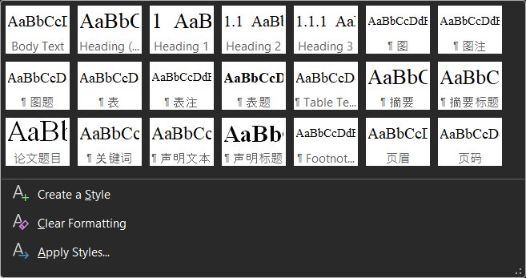

# BUAA Thesis Template

> BUAA 本科毕业论文 Word 模板

---

## 概述

该仓库为个人基于 Microsoft Word 编写的本科毕业论文模板，主要针对软件学院。包括论文示例 [Thesis Templar.docx](./Thesis%20Templar.docx) 和参考文献样式 [buaa-thesis-exp.csl](./buaa-thesis-exp.csl)。

论文中常用的样式都在 Styles Gallery 中列出，并按照使用频率进行了排序。可根据个人喜好进行添加或修改。

对于参考文献，建议使用 Zotero 等文献管理软件进行管理，导入 [buaa-thesis-exp.csl](./buaa-thesis-exp.csl)，使用 BUAA Thesis Citation (Experimental) 样式即可。

## 相关参考

- 原始 Word 模板来自[教务部](https://jiaowu.buaa.edu.cn/info/1025/2101.htm)
- 参考文献样式基于 [China National Standard GB/T 7714-2005 (numeric, 中文)](http://www.zotero.org/styles/chinese-gb7714-2005-numeric)
